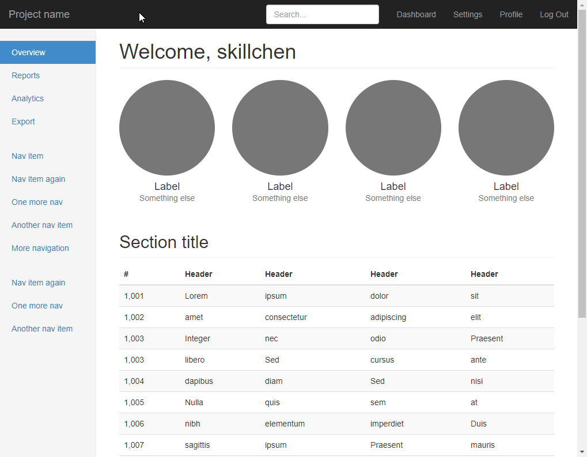

### Build a User Login System With Flask-Login,Flask-WTForms,Flask-Bootstrap,and Flask-SQLAlchemy
-   需要安裝 
    
        pip install flask flask_bootstrap flask-sqlalchemy flask_wtf flask_login 
-   當要產生資料庫時,使用python執行模式

        from app import db
        db.create_all()
        
-   執行畫面
-   